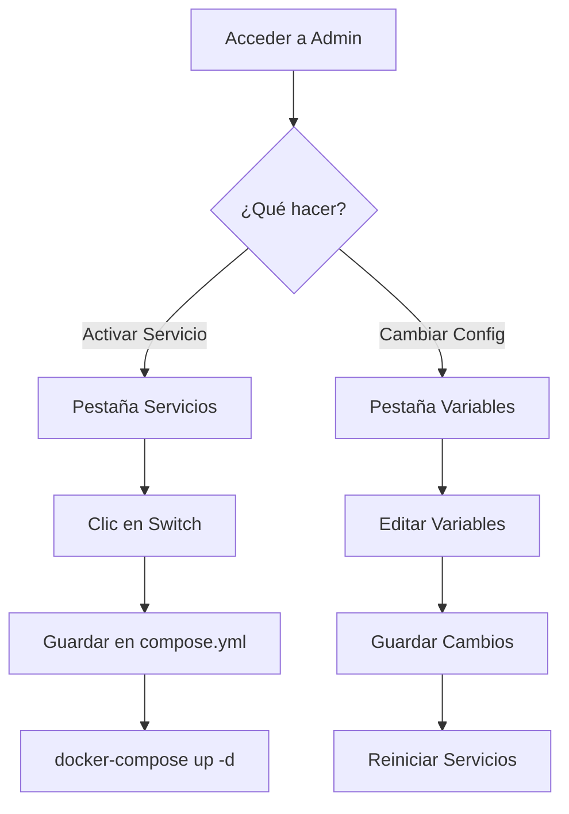

# 🎉 RaspiServer Admin Interface - Implementación Completa

## ✨ Resumen

Se ha implementado exitosamente una interfaz web de administración visual para RaspiServer que permite:

- ✅ **Activar/Desactivar servicios** con un simple clic
- ✅ **Editar variables de entorno** (.env) desde la web
- ✅ **Visualizar estado del sistema** y configuración
- ✅ **Interfaz moderna y responsiva** con diseño atractivo

## 📦 Archivos Creados

### Aplicación Principal
```
apps/raspiserver-admin/
├── app.py                    # Backend Flask con API REST
├── templates/
│   └── index.html           # Frontend HTML/CSS/JS
├── requirements.txt          # Dependencias Python
├── Dockerfile               # Imagen Docker
├── README.md                # Documentación técnica
└── VISUAL_PREVIEW.md        # Vista previa visual
```

### Configuración Docker
```
services/management/
└── raspiserver-admin.yml    # Definición del servicio Docker Compose
```

### Documentación
```
docs/
└── ADMIN_INTERFACE_GUIDE.md # Guía completa de usuario
```

### Scripts de Test
```
scripts/
└── test-admin-interface.sh  # Suite de pruebas automatizadas
```

### Actualizaciones
- ✅ `.env.dist` - Añadido `RASPISERVER_ADMIN_PORT=5000`
- ✅ `README.md` - Mencionado en servicios destacados
- ✅ `docker-compose.example.yml` - Añadido como servicio comentado
- ✅ `docs/QUICK_REFERENCE.md` - Actualizado con el nuevo servicio
- ✅ `scripts/validate-service.sh` - Añadido puerto de validación
- ✅ `.gitignore` - Añadidos archivos cache de Python

## 🚀 Inicio Rápido

### 1. Activar el Servicio

Edita `docker-compose.yml` y descomenta:

```yaml
include:
  - services/management/raspiserver-admin.yml
```

### 2. Iniciar

```bash
docker-compose up -d raspiserver-admin
```

### 3. Acceder

Abre en tu navegador:
```
http://localhost:5000
```

## 🎨 Características de la Interfaz

### Gestión de Servicios (Pestaña 1)

- **Organización por categorías**:
  - 🎬 Multimedia (Jellyfin, Sonarr, Radarr, etc.)
  - 🌐 Red y Seguridad (Pi-hole, NordVPN, etc.)
  - 📊 Automatización (Home Assistant, Netdata, etc.)
  - 🔧 Gestión (Portainer, Dockge, Homarr, etc.)
  - ☁️ Productividad (Nextcloud, n8n, etc.)
  - 🔄 Otros (qBittorrent, Telegram Bot, etc.)

- **Indicadores visuales**:
  - Tarjetas azules = Servicio activo
  - Tarjetas grises = Servicio inactivo
  - Switches verdes/grises para activar/desactivar

- **Funcionalidad**:
  - Clic en switch activa/desactiva servicio
  - Cambios se guardan en `docker-compose.yml`
  - Notificaciones en tiempo real

### Editor de Variables (Pestaña 2)

- **Variables organizadas por secciones**:
  - Configuración del Sistema
  - Rutas y Directorios
  - Configuración de Red
  - Seguridad y Contraseñas
  - Etc.

- **Características**:
  - Búsqueda y filtrado de variables
  - Comentarios explicativos para cada variable
  - Edición en tiempo real
  - Guardado con un clic

### Información del Sistema (Pestaña 3)

- Estado de archivos de configuración
- Verificación de requisitos
- Instrucciones de uso
- Advertencias de seguridad

## 🔧 Tecnologías Utilizadas

- **Backend**: Flask 3.0.0 (Python 3.11)
- **Frontend**: HTML5, CSS3, JavaScript Vanilla
- **API**: REST con JSON
- **Contenedor**: Docker con Docker Compose
- **Persistencia**: Archivos de texto (.env, docker-compose.yml)

## 📊 Arquitectura

```
┌─────────────────┐
│   Navegador     │
│  (localhost:5000)│
└────────┬────────┘
         │ HTTP/JSON
┌────────▼────────┐
│  Flask App      │
│  - API REST     │
│  - Templates    │
└────────┬────────┘
         │
┌────────▼────────┐
│  Archivos       │
│  - .env         │
│  - compose.yml  │
│  - services/*.yml│
└─────────────────┘
```

## 🔒 Consideraciones de Seguridad

⚠️ **IMPORTANTE**: 

1. **NO exponer puerto 5000 a Internet** sin autenticación
2. Usar detrás de proxy reverso (Nginx, Traefik)
3. Implementar autenticación (Authelia, Basic Auth)
4. Limitar acceso por IP/firewall
5. Cambiar todas las contraseñas por defecto

### Ejemplo de Protección con Nginx

```nginx
location /admin/ {
    auth_basic "Admin Area";
    auth_basic_user_file /etc/nginx/.htpasswd;
    proxy_pass http://localhost:5000/;
}
```

## ✅ Validación y Tests

Ejecuta el script de test:

```bash
bash scripts/test-admin-interface.sh
```

Tests incluidos:
- ✅ Verificación de archivos requeridos
- ✅ Validación de sintaxis Python
- ✅ Validación de sintaxis YAML
- ✅ Validación de Docker Compose
- ✅ Verificación de documentación

## 📚 Documentación

- **[README Técnico](../apps/raspiserver-admin/README.md)** - Documentación técnica del servicio
- **[Guía de Usuario](../docs/ADMIN_INTERFACE_GUIDE.md)** - Guía completa de uso
- **[Vista Previa Visual](../apps/raspiserver-admin/VISUAL_PREVIEW.md)** - Mockups de la interfaz

## 🎯 Casos de Uso

### 1. Configurar un Media Server desde Cero

1. Acceder a la interfaz admin
2. Activar: Jellyfin, Sonarr, Radarr, Prowlarr, qBittorrent
3. En Variables: configurar rutas de media y descargas
4. Ejecutar: `docker-compose up -d`
5. Configurar cada servicio desde sus interfaces web

### 2. Cambiar Puertos de Servicios

1. Ir a pestaña Variables de Entorno
2. Buscar `PORT` en el filtro
3. Modificar los puertos necesarios
4. Guardar cambios
5. Reiniciar servicios afectados

### 3. Activar Monitoreo del Sistema

1. Ir a pestaña Servicios
2. Activar: Netdata, Uptime Kuma, Portainer
3. Aplicar cambios: `docker-compose up -d`
4. Acceder a cada dashboard

## 🔄 Flujo de Trabajo Típico



## 🆚 Comparación con Otras Herramientas

| Característica | RaspiServer Admin | Portainer | Dockge | Homarr |
|----------------|-------------------|-----------|---------|---------|
| Gestión de Servicios | ✅ | ✅ | ✅ | ❌ |
| Editor .env | ✅ | ❌ | ❌ | ❌ |
| Específico para RaspiServer | ✅ | ❌ | ❌ | ❌ |
| Toggle Servicios | ✅ | ✅ | ✅ | ❌ |
| Dashboard | ❌ | ✅ | ❌ | ✅ |
| Logs en Tiempo Real | ❌ | ✅ | ✅ | ❌ |

**Conclusión**: RaspiServer Admin **complementa** (no reemplaza) a Portainer, Dockge y Homarr, ofreciendo funcionalidad específica para gestionar la configuración de RaspiServer.

## 🚧 Futuras Mejoras Posibles

- [ ] Integración con API de Docker para ver estado de contenedores
- [ ] Logs en tiempo real desde la interfaz
- [ ] Backup/Restore de configuraciones
- [ ] Sistema de autenticación integrado
- [ ] Gestión de volúmenes Docker
- [ ] Editor de archivos de configuración de servicios
- [ ] Validación de sintaxis antes de guardar
- [ ] Modo oscuro/claro
- [ ] Multi-idioma (i18n)
- [ ] Historial de cambios (git integration)

## 📝 Notas de Implementación

### Decisiones de Diseño

1. **Flask en lugar de FastAPI**: Mayor simplicidad, menor overhead
2. **Vanilla JS en lugar de framework**: Sin dependencias JS, más rápido
3. **Archivos de texto en lugar de BD**: Mantiene compatibilidad con workflow existente
4. **Montaje de todo el repo**: Permite lectura/escritura de todos los archivos necesarios

### Limitaciones Conocidas

1. **No detecta cambios externos**: Si editas archivos fuera de la interfaz, refresca la página
2. **Sin autenticación incorporada**: Debe usarse detrás de proxy con auth
3. **Cambios requieren docker-compose**: No ejecuta comandos automáticamente por seguridad
4. **Un usuario a la vez**: Sin manejo de concurrencia (pero OK para uso personal)

## 🎓 Aprendizajes

Este proyecto demuestra cómo crear una interfaz de administración moderna para infraestructura Docker:

- Manipulación de archivos YAML desde Python
- Creación de APIs REST simples con Flask
- Diseño responsive sin frameworks CSS
- Integración con Docker Compose
- Documentación técnica completa

## 🤝 Contribuciones

Para contribuir:

1. Fork del repositorio
2. Crear rama: `git checkout -b feature/nueva-funcionalidad`
3. Hacer cambios y commit
4. Push y crear Pull Request

## 📄 Licencia

Parte del proyecto RaspiServer, bajo la misma licencia.

---

**🎉 ¡Disfruta de tu nueva interfaz de administración!**

**Creado con ❤️ para la comunidad de self-hosting**
