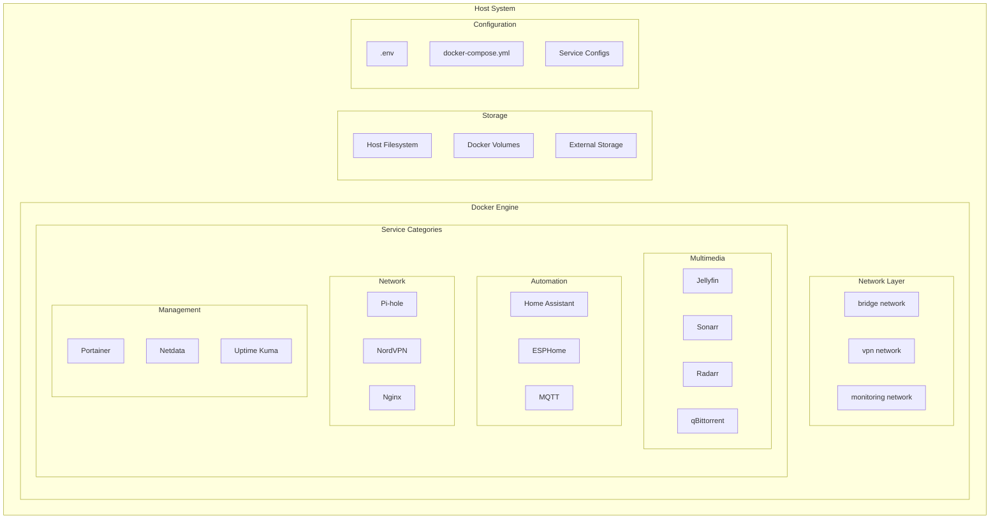
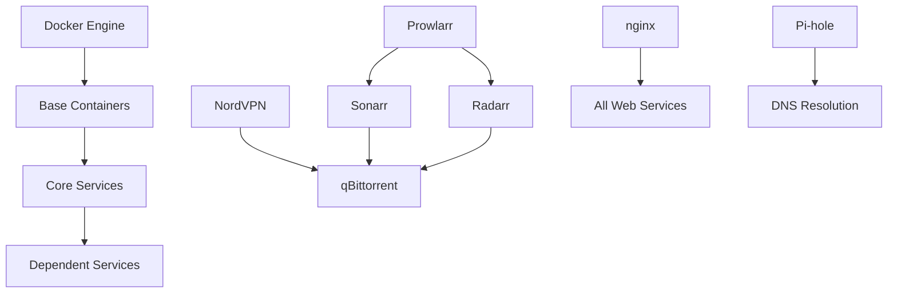
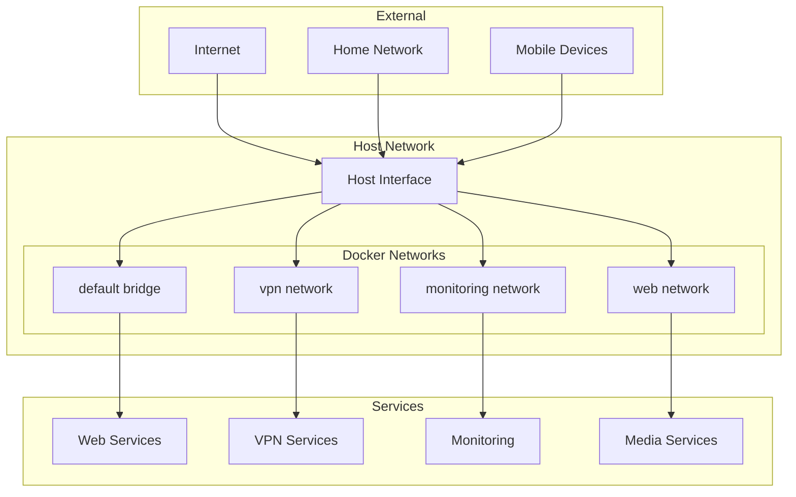
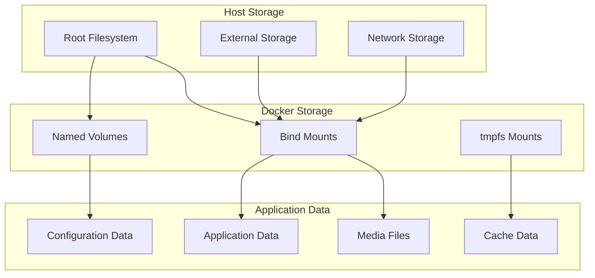
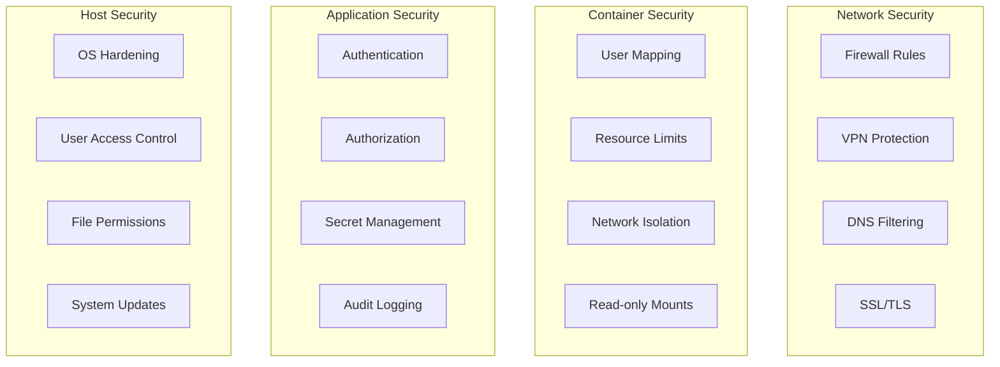
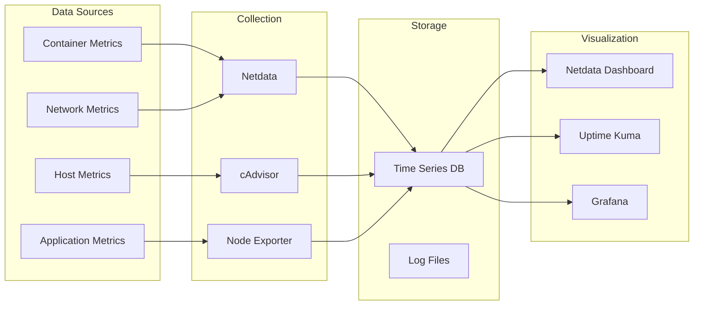

# Architecture Documentation - RaspiServer

Technical deep dive into the RaspiServer architecture, design decisions, and implementation details.

## 📋 Table of Contents

- [Overview](#overview)
- [System Architecture](#system-architecture)
- [Container Architecture](#container-architecture)
- [Network Architecture](#network-architecture)
- [Storage Architecture](#storage-architecture)
- [Security Architecture](#security-architecture)
- [Deployment Patterns](#deployment-patterns)

## 🏗️ Overview

RaspiServer is a containerized, microservices-based home server platform designed for:

- **Scalability**: Add/remove services independently
- **Maintainability**: Isolated service configurations
- **Security**: Network segmentation and access controls
- **Portability**: Docker-based deployment
- **Modularity**: Service-specific configurations

### Design Principles

1. **Container-First**: Everything runs in Docker containers
2. **Configuration as Code**: All settings in version control
3. **Separation of Concerns**: Each service has a specific purpose
4. **Data Persistence**: Stateful data separated from containers
5. **Security by Default**: Secure configurations out-of-the-box

## 🎯 System Architecture



### Layer Responsibilities

#### Host Layer
- **Operating System**: Raspberry Pi OS / Ubuntu
- **Docker Engine**: Container runtime
- **Storage Management**: File system and external mounts
- **Network Management**: Host networking and firewall

#### Container Layer
- **Service Isolation**: Each service in its own container
- **Resource Management**: CPU, memory, and storage limits
- **Process Management**: Container lifecycle and health checks
- **Inter-service Communication**: Docker networks

#### Application Layer
- **Service Logic**: Individual application functionality
- **Configuration Management**: Service-specific settings
- **Data Processing**: Application-specific data handling
- **User Interfaces**: Web UIs and APIs

## 🐳 Container Architecture

### Base Images

All services use LinuxServer.io images when available for:

- **Consistent User Management**: PUID/PGID support
- **Regular Updates**: Automated base image updates
- **Security**: Vulnerability scanning and patches
- **ARM Support**: Native ARM64 builds for Raspberry Pi

### Container Patterns

#### Stateless Services
```yaml
services:
  service-name:
    image: linuxserver/service:latest
    container_name: service-name
    restart: unless-stopped
    environment:
      - PUID=${PUID}
      - PGID=${PGID}
      - TZ=${TIMEZONE}
    ports:
      - "${SERVICE_PORT}:internal-port"
```

#### Stateful Services
```yaml
services:
  service-name:
    image: linuxserver/service:latest
    container_name: service-name
    restart: unless-stopped
    environment:
      - PUID=${PUID}
      - PGID=${PGID}
      - TZ=${TIMEZONE}
    volumes:
      - ${VOLUMES_DIR}/service-config:/config
      - ${MEDIA_DIR}:/media
    ports:
      - "${SERVICE_PORT}:internal-port"
```

#### VPN-Protected Services
```yaml
services:
  protected-service:
    image: service/image:latest
    container_name: protected-service
    restart: unless-stopped
    network_mode: service:nordvpn
    depends_on:
      - nordvpn
```

### Service Dependencies



## 🌐 Network Architecture

### Network Topology



### Port Allocation Strategy

#### Port Ranges
- **8000-8099**: Media services (Jellyfin, Plex)
- **8100-8199**: Management services (Portainer, Netdata)
- **8200-8299**: Automation services (Home Assistant)
- **8300-8399**: Network services (Pi-hole, AdGuard)
- **8400-8499**: Productivity services (Nextcloud)
- **8500-8999**: Additional services

#### Port Mapping
```bash
# Core Services
8096  - Jellyfin (Media Streaming)
8123  - Home Assistant (Automation)
8080  - qBittorrent (Downloads)
9000  - Portainer (Management)

# Arr Stack
8989  - Sonarr (TV Management)
7878  - Radarr (Movie Management)
6767  - Bazarr (Subtitles)
9696  - Prowlarr (Indexers)

# Network Services
80    - Pi-hole Web (DNS)
53    - Pi-hole DNS
443   - Nginx SSL
```

### Network Security

#### Firewall Rules
```bash
# Allow SSH
22/tcp

# Allow web services
80/tcp, 443/tcp

# Allow specific service ports
8096/tcp  # Jellyfin
8123/tcp  # Home Assistant
```

#### VPN Integration
- qBittorrent routes through NordVPN
- Kill switch prevents IP leaks
- Split tunneling for other services

## 💾 Storage Architecture

### Storage Hierarchy



### Volume Strategy

#### Configuration Volumes
```yaml
volumes:
  - ${VOLUMES_DIR}/service-config:/config
```
- Contains service configuration files
- Persistent across container updates
- Backed up regularly

#### Data Volumes
```yaml
volumes:
  - ${MEDIA_DIR}:/media:ro
  - ${DOWNLOADS_DIR}:/downloads
```
- Media files (read-only for streaming)
- Downloads (read-write for management)
- Large file storage

#### Temporary Volumes
```yaml
volumes:
  - /tmp:/tmp:rw
```
- Transcoding cache
- Temporary processing
- RAM-based when possible

### Storage Layout

```
/home/user/mediacheky/raspiserver/
├── volumes/                    # Docker persistent data
│   ├── jellyfin-config/       # Jellyfin configuration
│   ├── sonarr-config/         # Sonarr configuration
│   ├── radarr-config/         # Radarr configuration
│   └── ...
├── configs/                    # System configurations
├── apps/                       # Custom applications
└── media/                      # Media storage (optional)

/mnt/media/                     # External media storage
├── movies/
├── tv/
├── music/
└── books/

/mnt/downloads/                 # Download storage
├── complete/
├── incomplete/
└── watch/
```

## 🔒 Security Architecture

### Security Layers



### Security Implementations

#### Container Security
```yaml
# User mapping for security
environment:
  - PUID=${PUID}
  - PGID=${PGID}

# Resource constraints
deploy:
  resources:
    limits:
      cpus: '2.0'
      memory: 1G

# Read-only file systems where possible
volumes:
  - ${MEDIA_DIR}:/media:ro
```

#### Network Security
```yaml
# Network isolation
networks:
  internal:
    driver: bridge
    internal: true

# Expose only necessary ports
ports:
  - "127.0.0.1:8096:8096"  # Bind to localhost only
```

#### Secret Management
```bash
# Environment variables for secrets
NORDVPN_USER=username
NORDVPN_PASS=password

# Docker secrets for sensitive data
secrets:
  api_key:
    external: true
```

## 🚀 Deployment Patterns

### Development vs Production

#### Development Deployment
```yaml
# Hot reloading for development
volumes:
  - ./custom-scripts:/scripts:rw

# Debug logging
environment:
  - LOG_LEVEL=debug

# Direct port exposure
ports:
  - "8096:8096"
```

#### Production Deployment
```yaml
# Read-only configurations
volumes:
  - ./configs:/config:ro

# Production logging
environment:
  - LOG_LEVEL=warn

# Reverse proxy only
expose:
  - "8096"
```

### Scaling Strategies

#### Horizontal Scaling
```yaml
# Multiple instances behind load balancer
services:
  service:
    scale: 3
    deploy:
      replicas: 3
```

#### Vertical Scaling
```yaml
# Resource allocation
deploy:
  resources:
    limits:
      cpus: '4.0'
      memory: 8G
    reservations:
      cpus: '2.0'
      memory: 4G
```

### High Availability

#### Service Health Checks
```yaml
healthcheck:
  test: ["CMD", "curl", "-f", "http://localhost:8096/health"]
  interval: 30s
  timeout: 10s
  retries: 3
  start_period: 40s
```

#### Backup Strategies
```yaml
# Configuration backup
volumes:
  - backup-volume:/backup

# Automated backup script
command: |
  backup-script.sh
```

### Update Strategies

#### Rolling Updates
```bash
# Update one service at a time
docker-compose pull service-name
docker-compose up -d service-name
```

#### Blue-Green Deployment
```bash
# Switch environments
docker-compose -f docker-compose.blue.yml down
docker-compose -f docker-compose.green.yml up -d
```

## 📊 Monitoring Architecture

### Metrics Collection



### Alerting Strategy

#### Alert Levels
- **Critical**: Service down, data loss
- **Warning**: High resource usage, slow response
- **Info**: Routine events, updates

#### Notification Channels
- **Immediate**: SMS, push notifications
- **Delayed**: Email, Slack
- **Log-only**: File logs, metrics

## 🔧 Troubleshooting Architecture

### Logging Strategy

#### Log Aggregation
```yaml
logging:
  driver: "json-file"
  options:
    max-size: "10m"
    max-file: "3"
```

#### Centralized Logging
```yaml
logging:
  driver: "syslog"
  options:
    syslog-address: "udp://logserver:514"
    tag: "{{.Name}}"
```

### Debug Capabilities

#### Container Inspection
```bash
# Access container shell
docker-compose exec service-name bash

# View container configuration
docker inspect container-name

# Monitor resource usage
docker stats
```

#### Network Debugging
```bash
# Test connectivity
docker-compose exec service-name ping target

# Check DNS resolution
docker-compose exec service-name nslookup domain

# Port connectivity
docker-compose exec service-name telnet host port
```

---

**This architecture documentation provides the technical foundation for understanding, deploying, and maintaining the RaspiServer platform.**
