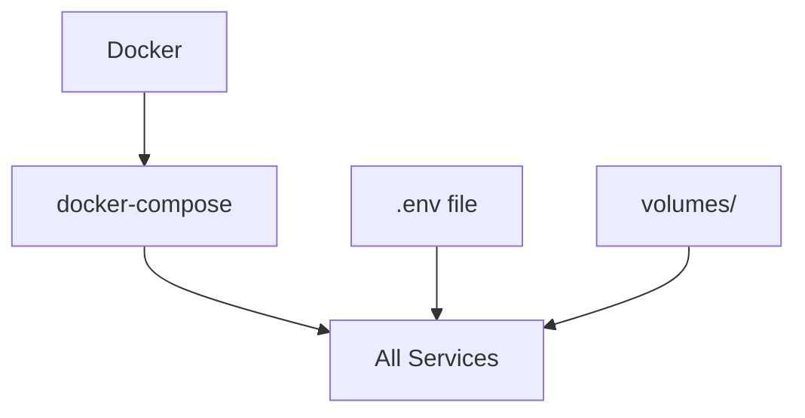
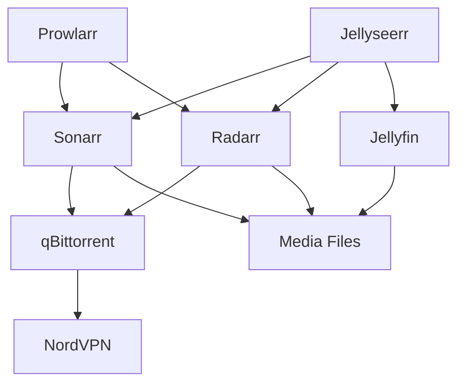
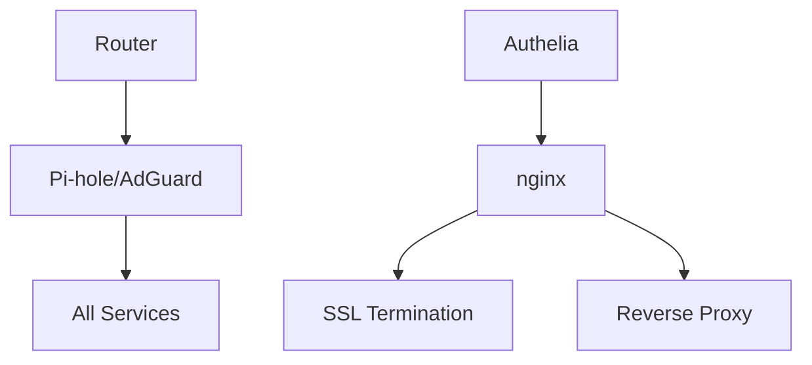

# Services Documentation - RaspiServer

Comprehensive guide for configuring and managing individual services in the RaspiServer stack.

## 📋 Table of Contents

- [Multimedia Services](#multimedia-services)
- [Home Automation](#home-automation)
- [Network & Security](#network--security)
- [Productivity](#productivity)
- [Monitoring & Management](#monitoring--management)
- [Service Dependencies](#service-dependencies)

## 🎬 Multimedia Services

### Jellyfin - Media Streaming Server

**Purpose**: Stream movies, TV shows, music, and other media content.

**Configuration**:
```yaml
# Default port: 8096
# Config location: ./volumes/jellyfin-config
```

**Setup Steps**:
1. Access: `http://your-ip:8096`
2. Create admin user
3. Add media libraries:
   - Movies: `/media/movies`
   - TV Shows: `/media/tv`
   - Music: `/media/music`
4. Configure metadata providers
5. Set transcoding preferences

**Key Features**:
- Hardware-accelerated transcoding (Intel GPU)
- Multiple user profiles
- Mobile and TV apps
- Live TV support (with tuner)

### Sonarr - TV Series Management

**Purpose**: Automatically download and organize TV series.

**Configuration**:
```yaml
# Default port: 8989
# Config location: ./volumes/sonarr-config
```

**Setup Steps**:
1. Access: `http://your-ip:8989`
2. **Media Management**:
   - Root folder: `/media/tv`
   - File naming: Enable season folders
   - Episode naming: S{season:00}E{episode:00}
3. **Download Clients**:
   - Add qBittorrent: `http://qbittorrent:8080`
   - Category: `sonarr`
4. **Indexers**:
   - Connect via Prowlarr (recommended)
   - Or configure manually
5. **Quality Profiles**:
   - Create custom profiles
   - Set size limits

**Custom Scripts** (in `apps/mediaserver/sonarr-arr-scripts/`):
- Post-processing scripts
- Notification scripts
- Custom actions

### Radarr - Movie Management

**Purpose**: Automatically download and organize movies.

**Configuration**:
```yaml
# Default port: 7878
# Config location: ./volumes/radarr-config
```

**Setup Steps**:
1. Access: `http://your-ip:7878`
2. **Media Management**:
   - Root folder: `/media/movies`
   - Movie naming: `{Movie Title} ({Release Year})`
3. **Download Clients**:
   - Add qBittorrent: `http://qbittorrent:8080`
   - Category: `radarr`
4. **Indexers**: Connect via Prowlarr
5. **Quality Profiles**: Configure preferred qualities

**Custom Scripts** (in `apps/mediaserver/radarr-arr-scripts/`):
- Movie processing enhancements
- Metadata enrichment

### Jellyseerr - Media Request Management

**Purpose**: User-friendly interface for requesting movies and TV shows.

**Configuration**:
```yaml
# Default port: 5055
# Config location: ./volumes/jellyseerr-config
```

**Setup Steps**:
1. Access: `http://your-ip:5055`
2. Connect to Jellyfin server
3. Connect to Sonarr and Radarr
4. Configure user permissions
5. Set up notifications

### Bazarr - Subtitle Management

**Purpose**: Automatically download subtitles for movies and TV shows.

**Configuration**:
```yaml
# Default port: 6767
# Config location: ./volumes/bazarr-config
```

**Setup Steps**:
1. Connect to Sonarr and Radarr
2. Configure subtitle providers
3. Set language preferences
4. Configure sync settings

### Prowlarr - Indexer Management

**Purpose**: Centralized indexer management for all *arr applications.

**Configuration**:
```yaml
# Default port: 9696
# Config location: ./volumes/prowlarr-config
```

**Setup Steps**:
1. Add indexers (trackers)
2. Connect to Sonarr, Radarr, etc.
3. Configure sync settings
4. Test connections

### qBittorrent - Torrent Client

**Purpose**: Download torrents with VPN protection.

**Configuration**:
```yaml
# Default port: 8080
# Config location: ./volumes/qbittorrent-config
# VPN: Routes through NordVPN container
```

**Setup Steps**:
1. Access: `http://your-ip:8080`
2. Default login: `admin`/`adminadmin`
3. **Settings**:
   - Downloads: `/downloads/incomplete`
   - Completed: `/downloads/complete`
   - Enable categories
4. **Categories**:
   - `sonarr`: TV downloads
   - `radarr`: Movie downloads
   - `manual`: Manual downloads

**VPN Integration**:
- Automatically routes through NordVPN
- Kill switch prevents leaks
- No configuration needed

### Additional Multimedia Services

#### Lidarr - Music Management
- Port: 8686
- Purpose: Music collection management
- Similar setup to Sonarr/Radarr

#### Readarr - Book Management
- Port: 8787
- Purpose: eBook and audiobook management
- Integrates with Calibre

#### Mylar3 - Comic Management
- Port: 8090
- Purpose: Comic book collection management

## 🏠 Home Automation

### Home Assistant - Smart Home Hub

**Purpose**: Central hub for home automation and IoT devices.

**Configuration**:
```yaml
# Default port: 8123
# Config location: apps/homeassistant/app-config
```

**Setup Steps**:
1. Access: `http://your-ip:8123`
2. Create admin user
3. Configure location and timezone
4. Install HACS (Home Assistant Community Store)
5. Add integrations for your devices

**Key Configurations**:
- `configuration.yaml`: Main configuration
- `automations.yaml`: Automated tasks
- `scripts.yaml`: Reusable scripts
- `scenes.yaml`: Device scenes

**Advanced Features**:
- ESPHome integration
- MQTT broker support
- Custom components

### ESPHome - ESP Device Management

**Purpose**: Manage ESP32/ESP8266 devices.

**Configuration**:
```yaml
# Default port: 6052
# Integrates with Home Assistant
```

### MQTT - IoT Messaging

**Purpose**: Message broker for IoT devices.

**Configuration**:
```yaml
# Default port: 1883
# Web UI: 9001
```

## 🌐 Network & Security

### Pi-hole - DNS-based Ad Blocker

**Purpose**: Network-wide ad and tracker blocking.

**Configuration**:
```yaml
# Default port: 80, 443 (web), 53 (DNS)
# Config location: ./volumes/pihole-config
```

**Setup Steps**:
1. Access web interface: `http://your-ip/admin`
2. Set admin password
3. Configure blocklists
4. Update router DNS to Pi-hole IP

### AdGuard Home - Alternative DNS Filtering

**Purpose**: Advanced DNS filtering and parental controls.

**Configuration**:
```yaml
# Default port: 3000 (setup), 80 (admin)
# Alternative to Pi-hole
```

### NordVPN - VPN Protection

**Purpose**: Secure internet connection for sensitive services.

**Configuration**:
```yaml
# Protects qBittorrent and other services
# Custom container in apps/nordvpn/
```

**Environment Variables**:
```bash
NORDVPN_USER=your_username
NORDVPN_PASS=your_password
NORDVPN_COUNTRY=Spain
NORDVPN_GROUP=P2P
```

### Authelia - Authentication Gateway

**Purpose**: Single sign-on and multi-factor authentication.

**Configuration**:
```yaml
# Protects services with authentication
# Integrates with nginx proxy
```

## 📋 Productivity

### Nextcloud - Self-hosted Cloud

**Purpose**: File storage, synchronization, and collaboration.

**Configuration**:
```yaml
# Default port: 8081
# Config location: ./volumes/nextcloud-config
```

**Setup Steps**:
1. Initial setup wizard
2. Create admin user
3. Configure database (MySQL/PostgreSQL)
4. Install recommended apps
5. Set up external storage

**Features**:
- File synchronization
- Calendar and contacts
- Office suite integration
- Talk (video calls)

## 📊 Monitoring & Management

### Netdata - Real-time Monitoring

**Purpose**: Real-time system and container monitoring.

**Configuration**:
```yaml
# Default port: 19999
# Zero-configuration monitoring
```

### Uptime Kuma - Service Monitoring

**Purpose**: Monitor service uptime and performance.

**Configuration**:
```yaml
# Default port: 3001
# Config location: ./volumes/uptime-kuma-config
```

**Setup Steps**:
1. Create admin user
2. Add monitors for each service
3. Configure notifications
4. Set up status pages

### Portainer - Docker Management

**Purpose**: Web-based Docker container management.

**Configuration**:
```yaml
# Default port: 9000
# Manages local Docker environment
```

### Jellystat - Jellyfin Analytics

**Purpose**: Advanced analytics for Jellyfin usage.

**Configuration**:
```yaml
# Default port: 3000
# Requires Jellyfin API access
```

## 🔗 Service Dependencies

### Core Dependencies



### Multimedia Stack Dependencies



### Network Dependencies



## ⚙️ Service Configuration Files

### Environment Variables

Each service can be configured via `.env`:

```bash
# Service-specific ports
JELLYFIN_PORT=8096
SONARR_PORT=8989
RADARR_PORT=7878
JELLYSEERR_PORT=5055

# Paths
MEDIA_DIR=/mnt/media
DOWNLOADS_DIR=/mnt/downloads

# VPN settings
NORDVPN_USER=username
NORDVPN_PASS=password
```

### Volume Mapping

Standard volume structure:
```
volumes/
├── service-name-config/     # Service configuration
├── service-name-data/       # Service data
└── service-name-logs/       # Service logs
```

### Custom Configurations

Service-specific configs in `configs/`:
```
configs/
├── nginx/                   # Reverse proxy configs
├── homeassistant/          # HA configurations
└── system/                 # System-level configs
```

## 🔧 Troubleshooting Services

### Common Issues

#### Service Won't Start
```bash
# Check logs
docker-compose logs service-name

# Check dependencies
docker-compose ps

# Restart service
docker-compose restart service-name
```

#### Permission Issues
```bash
# Fix ownership
sudo chown -R $USER:$USER ./volumes/service-config

# Check PUID/PGID
id
```

#### Network Issues
```bash
# Test connectivity
docker-compose exec service-name ping google.com

# Check port bindings
docker-compose ps
```

### Service-Specific Troubleshooting

#### Jellyfin
- **No hardware acceleration**: Check Intel GPU drivers
- **Transcoding fails**: Verify codec support
- **Library not updating**: Check file permissions

#### Sonarr/Radarr
- **Downloads fail**: Check qBittorrent connection
- **Files not moving**: Verify path mappings
- **Indexer errors**: Check Prowlarr sync

#### qBittorrent
- **VPN not working**: Check NordVPN container logs
- **Port blocked**: Verify VPN port forwarding
- **Downloads slow**: Check VPN server

## 📚 Additional Resources

- [Docker Compose Documentation](https://docs.docker.com/compose/)
- [LinuxServer.io Documentation](https://docs.linuxserver.io/)
- [Home Assistant Documentation](https://www.home-assistant.io/docs/)
- [Jellyfin Documentation](https://jellyfin.org/docs/)

---

**Note**: This documentation covers the most common services. For additional services, refer to their specific documentation and adapt the configuration patterns shown here.
